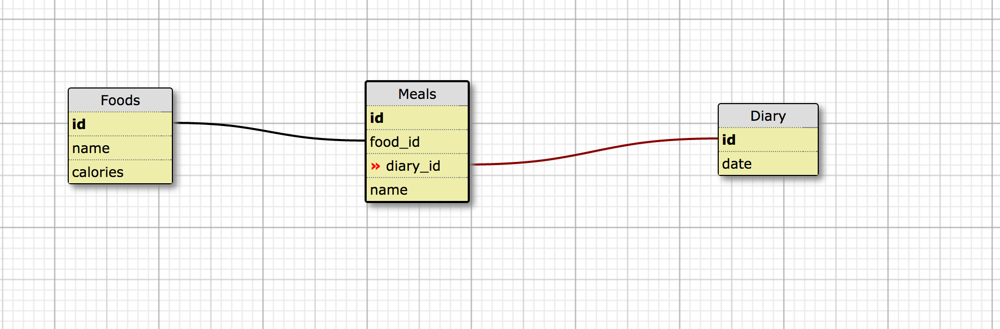

# quantified-self-be

This API lives at `https://qs-be.herokuapp.com/api/v1`

Endpoints:

  * 'GET' /foods - Returns all foods in db
  * 'GET' /foods/:id - Returns a single food that corresponds to the given id
  * 'POST' /foods - Allows you to post a new food to the db, requires that you include the name and calories. 
  * 'DELETE' /foods/:id - Changes the status of a food from active to inactive
  * 'PATCH' /foods/:id - Allows you to edit the name or calories of a particular food.
  * 'GET' /diaries/meals - Returns all the meals with their associated foods for a particular diary date. Must pass date through as params.
  * 'POST' /meals - Allows user to post a new meal, must include food and diary ids. 
  * 'DELETE' /meals/:id - Allows a user to delete a meal. 
  * 'GET' /search - Querries the db for records that match data recieved from request. 
  
Schema

